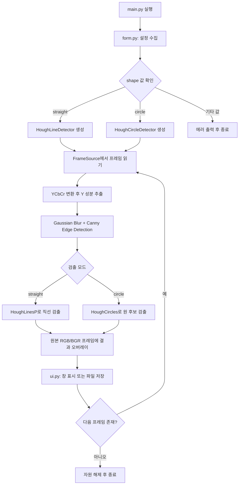

# YCbCr Y 기반 Canny + Hough 직선/원 검출 프로그램

이 프로젝트는 `main.py`, `form.py`, `ui.py` 세 파일로 구성된다. 입력 영상에서 YCbCr의 Y 성분만 추출한 뒤 Canny Edge Detection을 적용하고, 선택한 모드에 따라 Hough Line Detection 또는 Hough Circle Detection을 수행한다.

## 1. 실행 방법

### 1.1 필요 패키지 설치

```bash
python -m pip install opencv-python numpy
```

WSL 또는 Debian 계열 Linux에서는 다음처럼 실행할 수 있다.

```bash
python3 -m pip install opencv-python numpy
python3 main.py
```

Windows PowerShell에서는 다음처럼 실행할 수 있다.

```powershell
py -m pip install opencv-python numpy
py main.py
```

### 1.2 대화형 Form으로 실행

`main.py`를 실행하면 터미널 입력이 가능한 환경에서 `form.py`가 다음 값을 묻는다.

- 검출 모드: `straight` 또는 `circle`
- 입력 소스: 카메라 번호 `0`, 동영상 경로, 이미지 경로
- 직선 모드 옵션: 차선 필터 사용 여부
- 원 모드 옵션: 우측 상단 우선 여부
- 최대 처리 프레임 수

예시:
```bash
python3 main.py
```

입력에서 Enter만 누르면 기본값을 사용한다.

### 1.3 명령행 인자로 실행

대화형 입력을 생략하려면 `--no-form`을 사용한다.

```bash
python3 main.py --no-form --shape straight --source ./road.mp4 --lane-filter on
```

원 검출 예시:

```bash
python3 main.py --no-form --shape circle --source ./circle_test.mp4 --circle-priority off
```

이미지 파일도 입력으로 사용할 수 있다.

```bash
python3 main.py --no-form --shape straight --source ./road.jpg
```

### 1.4 환경변수로 실행

기존 요구사항의 `shape` 환경변수도 지원한다.

```bash
shape=straight VIDEO_SOURCE=./road.mp4 python3 main.py --no-form
```

Windows PowerShell:

```powershell
$env:shape="circle"
$env:VIDEO_SOURCE="C:\path\to\circle.mp4"
py main.py --no-form
```

### 1.5 WSL / Debian 계열 Linux의 표시 방식

Windows에서는 기본적으로 OpenCV 창을 띄운다. Linux/WSL에서는 GUI가 안전하게 확인되지 않으면 창을 띄우지 않고 `output/` 폴더에 PNG와 MP4 결과를 저장한다.

GUI가 정상 연결된 Linux/WSL에서 창 표시를 강제로 사용하려면 다음처럼 실행한다.

```bash
OPENCV_GUI=1 python3 main.py
```

WSL에서 `--source 0`을 사용했는데 `/dev/video0`이 없으면 카메라를 열 수 없다. 이 경우 동영상 파일 또는 이미지 파일 경로를 입력 소스로 사용한다.

## 2. 코드의 흐름

### 2.1 파일 역할

| 파일 | 역할 |
|---|---|
| `form.py` | 사용자 입력, 명령행 인자, 환경변수를 읽어 `RuntimeConfig`를 만든다. |
| `main.py` | YCbCr Y 추출, Canny, Hough Line/Circle 검출 등 분석 로직을 수행한다. |
| `ui.py` | Windows, WSL, Linux 환경을 감지하고 창 표시 또는 파일 저장을 담당한다. |

### 2.2 전체 처리 흐름



### 2.3 주요 로직

1. `form.py`
   - `UserInputForm`이 `--shape`, `--source`, 환경변수 `shape`, `SHAPE`, `VIDEO_SOURCE` 등을 읽는다.
   - 터미널 입력이 가능하면 사용자에게 대화형으로 설정값을 다시 묻는다.
   - `RuntimeConfig`는 불변 데이터 클래스로 관리한다.

2. `main.py`
   - `compute_ycbcr_y()`에서 `Y = 0.299R + 0.587G + 0.114B` 공식을 사용한다.
   - `CannyEdgeDetector`는 Y 성분에만 Canny를 적용한다.
   - `HoughLineDetector`는 `cv2.HoughLinesP()`로 직선을 찾고, 필요하면 차선형 각도와 하단 영역 필터를 적용한다.
   - `HoughCircleDetector`는 `cv2.HoughCircles()`로 원 후보를 찾고, Canny 에지 지지도 기반으로 가장 원형에 가까운 후보를 고른다.

3. `ui.py`
   - `EnvironmentInfo`가 Windows, Linux, WSL, GUI 가능 여부를 판정한다.
   - `ResultDisplayManager`는 Canny 결과와 Hough 오버레이 결과를 좌우로 붙여 보여 주거나 저장한다.
   - Headless 환경에서는 `output/` 폴더에 결과 이미지와 동영상을 저장한다.

## 3. 참고 자료 및 기타 사항

### 3.1 참고 자료

- 수업 PDF: `Computer Vision Report 06: Hough Line Detection`
- OpenCV 공식 문서: Canny Edge Detection  
  <https://docs.opencv.org/4.x/da/d22/tutorial_py_canny.html>
- OpenCV 공식 문서: Hough Line Transform  
  <https://docs.opencv.org/4.x/d9/db0/tutorial_hough_lines.html>
- OpenCV 공식 문서: Hough Circle Transform  
  <https://docs.opencv.org/4.x/da/d53/tutorial_py_houghcircles.html>

### 3.2 설정 우선순위

설정값은 다음 우선순위로 적용된다.

1. 명령행 인자: `--shape`, `--source` 등
2. 환경변수: `shape`, `SHAPE`, `VIDEO_SOURCE` 등
3. `main.py` 상단 기본 설정값
4. 대화형 Form 입력값: 터미널에서 최종 보정

대화형 Form에서 값을 바꾸면 최종 설정이 그 값으로 갱신된다.

### 3.3 제출용 캡처 방법

1. 프로그램을 실행한다.
2. `output/` 폴더에서 `result_*.png` 파일을 확인한다.
3. Canny Edge Detection 화면과 Hough Detection 오버레이 화면이 좌우로 함께 저장된 이미지를 보고서에 붙여 넣는다.
4. Windows GUI 환경에서는 실행 중 OpenCV 창을 캡처해도 된다.

### 3.4 WSL 카메라 주의사항

WSL에서 카메라 번호 `0`을 입력해도 `/dev/video0` 장치가 연결되어 있지 않으면 OpenCV가 카메라를 열 수 없다. 이 경우 다음처럼 동영상 파일을 입력으로 지정한다.

```bash
python3 main.py --no-form --shape straight --source ./road.mp4
```
